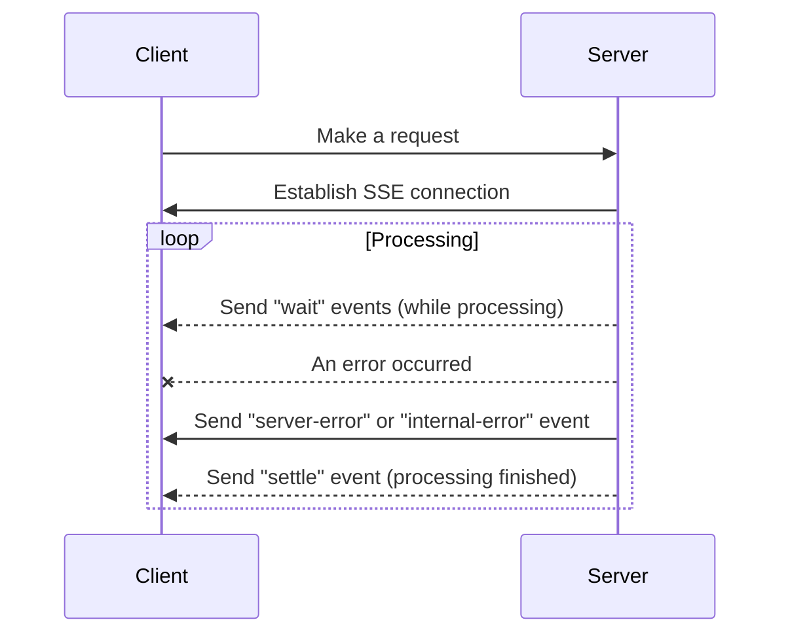

# next-server-task

[](https://github.com/Neo-Ciber94/next-server-task/actions/workflows/ci.yml)

Execute long running tasks on `NextJS` edge API handlers.

## Table of contents

1. [How it works?](#how-it-works)
2. [Usage example](#usage-example)
3. [Accessing the request with TaskServerContext](#accessing-the-request-with-taskservercontext)
4. [TaskError](#taskerror)
5. [License](#license)

## Install

```bash
npm install next-server-task
```

```bash
yarn add next-server-task
```

```bash
pnpm add next-server-task
```

## How it works?



We can keep the connection alive thanks we use [Server Sent Events](https://web.dev/articles/eventsource-basics), while the
task is running we sent a `wait` event each 300ms (this can be changed) to notify we still processing, if not error happened we send a `settle` event with the data, if an error ocurred we send an `internal-error` if the error was unexpected or a `server-error` of the error was throw using `TaskError`, these errors are rethrow on the client and the connection is closed.

## Usage example

In this example we use the **OpenAI** to generate images which can take a long time to generate the images,
this usually led to timeouts when using platforms like vercel, but using `next-server-task` we can wait until the task
finish and send the result after that.

On the server:

```ts
// app/api/generate-image/route.tsx

import { TaskError } from "next-server-task";
import { createTask } from "next-server-task/server";
import { OpenAI } from "openai";

export const runtime = "edge";

const generateImage = createTask("/api/generate-image").withAction(
  async ({ prompt }: { prompt: string }) => {
    const openAPI = new OpenAI({ apiKey: process.env.OPENAI_API_KEY });
    const results = await openAPI.images.generate({ prompt });

    const url = results.data[0].url;

    if (url == null) {
      throw new TaskError("Failed to generate image");
    }

    return { url };
  }
);

export type GenerateImage = typeof generateImage;

const { handler } = generateImage.serverHandler();
export { handler as GET };
```

On the client

```tsx
// ImageGenerator.tsx

import React, { useState } from "react";
import Image from "next/image";
import { type GenerateImage } from "./api/generate-image/route";
import { createClient } from "next-server-task/client";

const client = createClient<GenerateImage>();

export default function ImageGenerator() {
    const [imageUrl, setImageUrl] = useState<string>();
    const [error, setError] = useState<string>();
    const { mutate, isMutating } = client.useTask("/api/generate-image");

    const handleSubmit = async (e: React.FormEvent<HTMLFormElement>) => {
        e.preventDefault();

        setError(undefined);
        const form = new FormData(e.currentTarget);
        const prompt = form.get("prompt")?.toString() ?? "";
        
        try {
            const result = await mutate({ prompt });
            setImageUrl(result.url);
        }
        catch (err: any) {
            const message = err?.message ?? "Failed to generate image";
            setError(message);
        }
    };

    return <div>
        {imageUrl && 
            <Image 
                alt={"Generated Image"} 
                src={imageUrl} 
                width={256} 
                height={256}
            />}

        <form onSubmit={handleSubmit}>
            <input placeholder="Prompt..." name="prompt"/>
            <button type="submit">Generate</button>
        </form>

        {isMutating && <p>Loading...</p>}
        {error && <p style={{ color: "red" }}>{error}</p>}
    </div>
}
```

## Accessing the request with TaskServerContext

You can access the request in the task using the `TaskServerContext`.

The `TaskServerContext` had this shape:

```ts
type TaskServerContext = {
    req: Request,
    params: Record<string, string | undefined>
}
```

```ts
// server
const myTask = createTask("/api/my-task").withAction((_, ctx) => {
    const url = ctx.req.url;
    return { url };
})
```

## TaskError

You can throw expected errors using `TaskError`, this errors are rethrow on the client side as a `TaskClientError` so can be handled in a `try-catch` block.

```ts
// server
const myTask = createTask("/api/my-task").withAction(() => {
    const randomNumber = Math.random();
    if (randomNumber > 0.5) {
        throw new TaskError("Invalid number");
    }

    return { randomNumber };
})
```

```ts
// client
const { mutate, isMutating} = useTask("/api/my-task");

try {
    const { randomNumber } = mutate();
    console.log(randomNumber);
}
catch (err) {
    if (err instanceof TaskClientError) {
        console.log(err.message, err.code);
    }
}
```

## License

This project is licensed under the MIT License - see the LICENSE file for details.
